In this project, we propose several simple workflows for cell detection and counting, and compare their performance on a cyanobacterial dataset downloaded from Kaggle. The data, code and results are available in a GitHub repository [^1].

## Motivation and objective

This year, I participate in the Prague iGEM team focusing on cyanobacteria cultivation. The project is still in the beginning, and one of the biggest challenges for us at the moment is to keep track of the basic properties of the cultures, such as the number of (living) cells. The main reason for this being so difficult is that the cells tend to clump together, making optical density measurements unreliable. One of the proposed workarounds is to use images from a sufficiently large number of samples and automate the cell counting.

> **Fig. 1. Sample image of the culture taken in the lab.** Note that the image is technically a photo of a computer screen, as we did not manage to automate the process yet.

However, we were not able to produce enough images to use as a dataset for workflow development. Therefore, we searched for cyanobacterial microscopy image datasets, and found a suitable one on Kaggle.

The goal of the project was to propose, evaluate and compare several simple workflows to detect and count cells from raw images. The workflows needed to work out of the box, without exhaustive pretraining, as our project would not have enough resources to generate training datasets.

## Dataset

The dataset named Microalgae Population Microscopy for Automated Counting [^2] contains approximately 460 optical microscopy images of microalgae populations. We decided to use a subset consisting of first 100 images from `train` split, as comparing the workflows across all the images would require too much time.

According to the dataset description, the images were taken using a mobile phone camera, through a light microscope with 20x magnification, and manually labeled by the author (although he also mentions some consultation with experts). There was only one class of labels, as all cells probably belonged to the same species. The information about the dataset was written in Spanish; however, we simply translated it using a web browser extension.

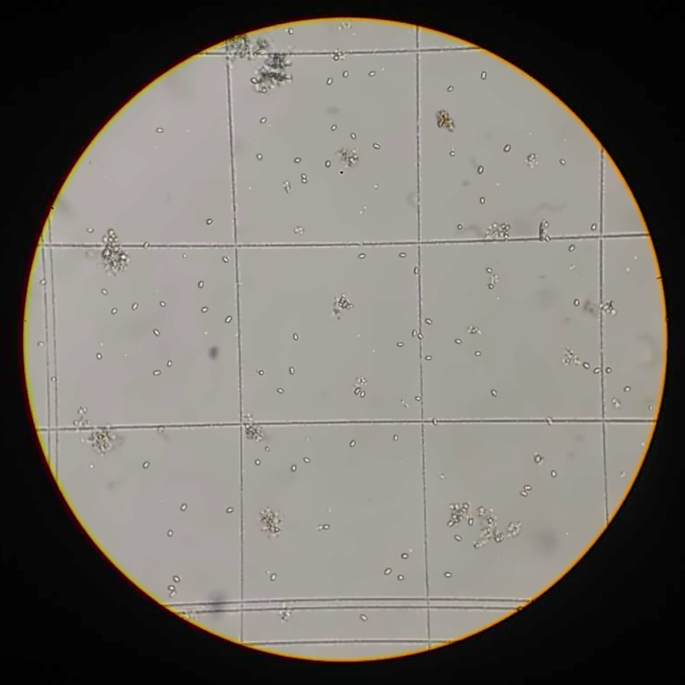

> **Fig. 2. Sample image from the dataset which was used to generate the workflows, cropped.** A lot of cells, and several cell clusters can be seen, as well as some background noise such as shadows and counting chamber grid marks. 

## Methods and workflows

We tried two main approaches: using basic Analyze Particles function in FIJI, and using Cellpose plugin with pretrained machine learning model (*cellpose* workflow). With the first approach, we proposed two different workflows, based on whether large cell clusters were being detected as separate entities (*clusters* workflow) or not (*simple* workflow).

In the beginning, the workflows were performed and tuned manually in FIJI and recorded as macros. However, we wanted to run FIJI in headless mode, and some of the steps crucial for the workflow were crashing when performed without a GUI. We investigated this issue using Claude Sonnet 5 and used it to rewrite some of the functions based on the source code of the original functions.

Every workflow consists of two main steps: preprocessing and cell detection. In preprocessing, the images are first converted to grayscale, background is subtracted and small Gaussian blur is applied. Then, in the *simple* and *clusters* workflow, the image is thresholded and converted to binary. Finally, in *simple* workflow, Watershed algorithm is applied to separate individual cells inside large detected clusters.

In the *cellpose* workflow, the preprocessed image is then passed to Cellpose plugin using basic pretrained model. In *simple* and *clusters* workflow, the binary image is passed to Analyze Particles function, and particles are filtered to match circularity at least $0.3$ and size at least $25$ pixels. Additionally, *clusters* workflow restricts cells to be of maximal size of $225$ pixels, and detects objects bigger than this threshold with circularity at least $0.1$ (to get rid of counting chamber grid marks).
The results are saved as a CSV file with coordinates of the detected cells, their sizes and additional data which are not used.

For each workflow and each image, we compared the detected cells to dataset labels, counting true positives, false positives (detections that were not in the label set) and false negatives (labels that were not detected). From those data, we computed accuracy, precision, recall and F1 score for each image.

Computing matching between the detected cells and labels was done using heuristic that matched closest pairs from which both cells were not yet matched, as long as the distance between them was less than half of the average size of the cells. We implemented this in Python script `compare_results.py`. To be able to compare detected clusters, which were not in the dataset labels, we used `compare_results_clusters.py`, a similar script that also tries to group overlapping labels into clusters. The scripts also save the initial images overlayed with the resulting rectangles around the detected cells and labels, colored by the type of the (mis)match. This allowed us to visually inspect the results and see in which cases do the workflows fail and how.

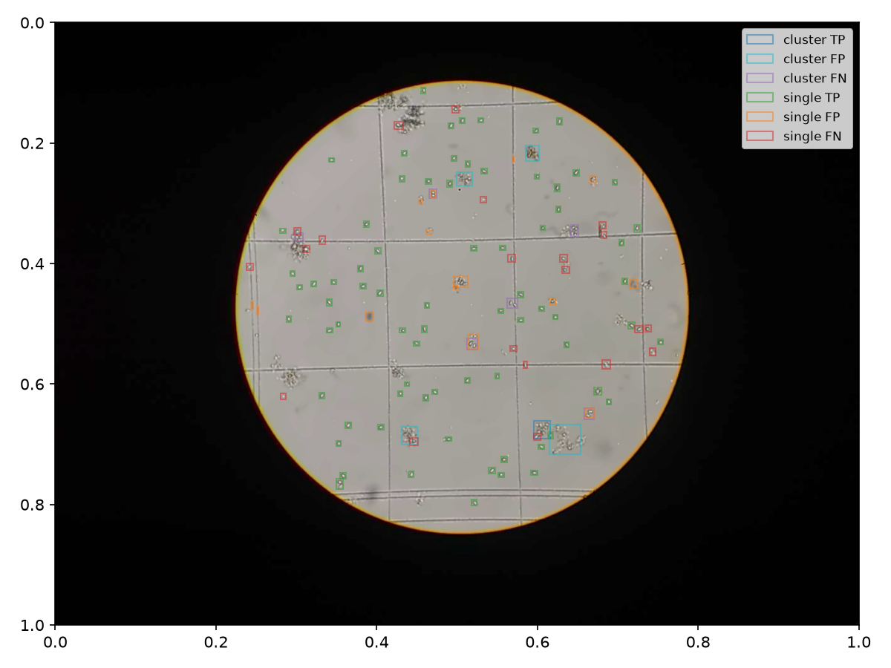

> **Fig. 3. Overlay of the detected cells and labels over Fig. 2, using *clusters* workflow.** The green rectangles mark true positive detections, orange mark false positives and red mark false negatives. Dark blue, cyan and purple rectangles represent the same outcomes for clusters.

| Workflow | Preprocessing | Analysis |
|----------|---------------|----------|
| Clusters | [grayscale, background removal, gaussian blur, thresholding](./workflows/clusters/Preprocess.ijm) | [Analyze Particles, separately small and big](./workflows/clusters/Analyze.ijm) |
| Simple   | [grayscale, background removal, gaussian blur, thresholding, watershed](./workflows/simple/Preprocess.ijm)   | [Analyze Particles](./workflows/simple/Analyze.ijm)   |
| Cellpose | [grayscale, background removal, gaussian blur](./workflows/cellpose/Preprocess.ijm) | [Cellpose plugin with pretrained model](./workflows/cellpose/Analyze.ijm) |

## Results

Every workflow was successful in identifying single cells that do not touch anything in the image, but had problems identifying cells which were touching the grid lines. *simple* workflow sometimes identified parts of the grid as cells (despite the circularity constraints), *cellpose* workflow did that even more often. All workflows also gathered quite a lot of false positive results by identifying objects that were not target microalgae cells but looked very similar.

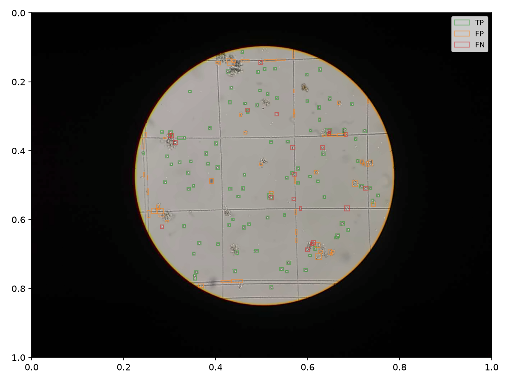

> **Fig. 4. Overlay of the detected cells and labels over Fig. 2, using *simple* workflow.** The green rectangles mark true positive detections, orange mark false positives and red mark false negatives.

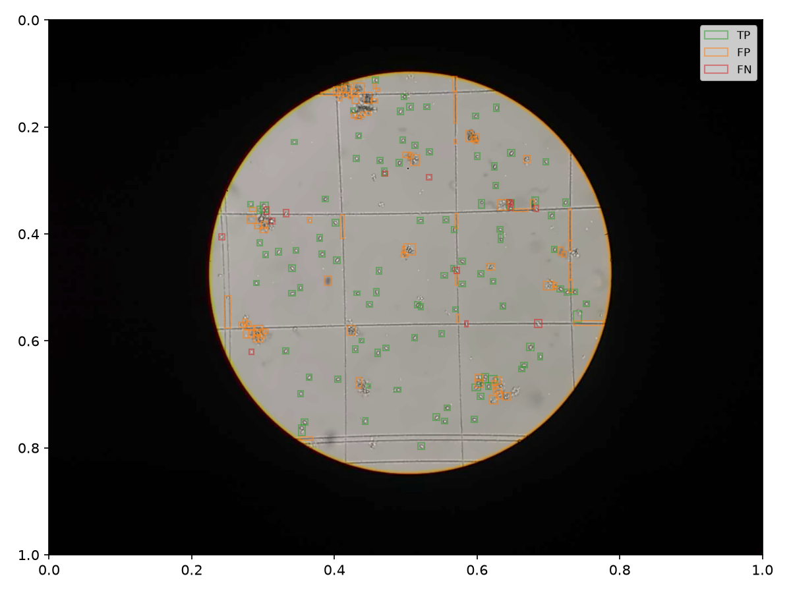

> **Fig. 5. Overlay of the detected cells and labels over Fig. 2, using *cellpose* workflow.** The green rectangles mark true positive detections, orange mark false positives and red mark false negatives.

Generally, both false positive and false negative rates are rather high. The only exception is *simple* workflow, where false negative (not detected cells) are always below $40\%$, with average of $20\%$. For cluster detection in *clusters* workflow, almost no clusters are usually matched at all with the clustered labels.

For all workflows there exist images where there are more than twice the amount of false positive cells than the labeled ones.

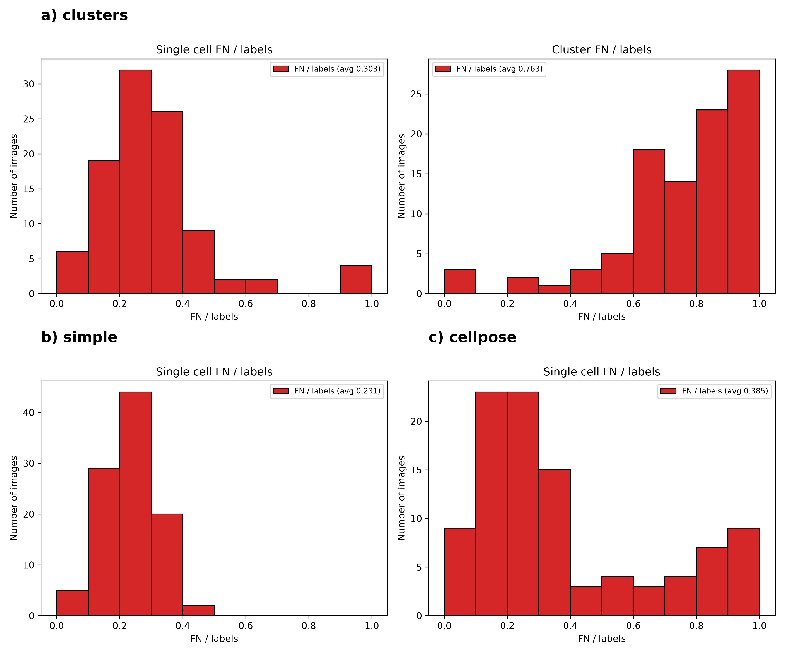

> **Fig. 6. False negative detections to label count ratio histogram.** a) *clusters*, b) *simple*, c) *cellpose*

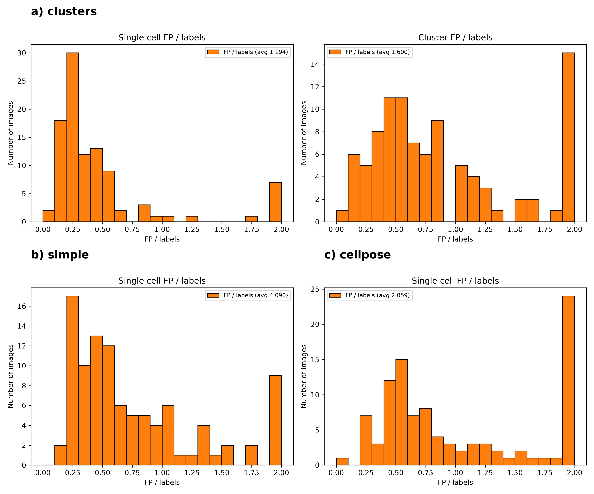

> **Fig. 7. False positive detections to label count ratio histogram.** a) *clusters*, b) *simple*, c) *cellpose*. Some images contained a high number of false positives, ratios bigger than $2$ were put into the last bin.

In some cases, usually when the real cell count was small, *cellpose* workflow failed spectacularly and detected lots of cells outside the relevant image, while also ignoring most of the real cells.  

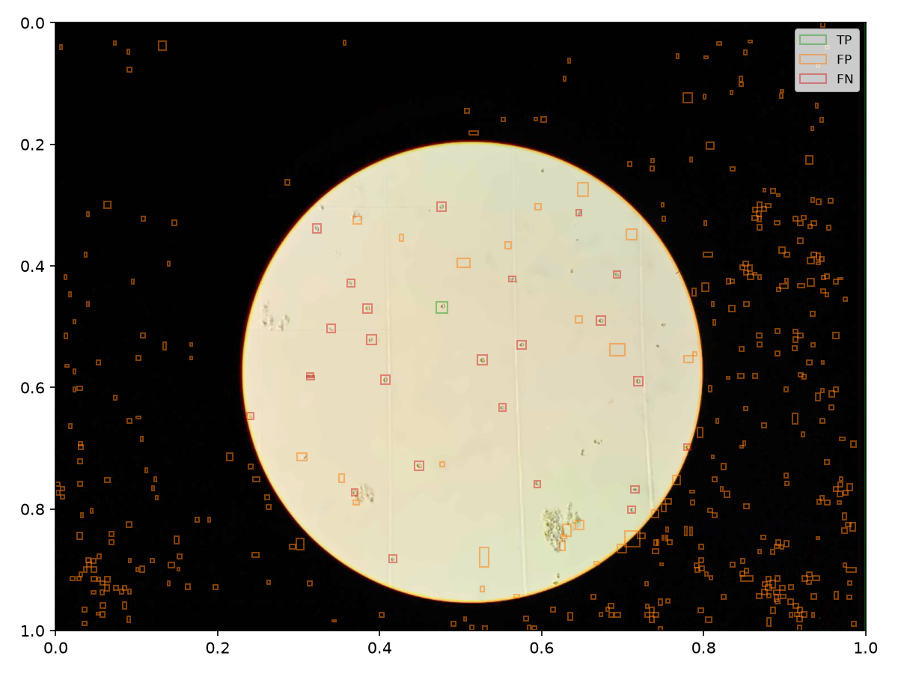

> **Fig. 8. Overlay of the detected cells and labels using *cellpose* workflow, failing and generating a lot of false positive results.** The green rectangles mark true positive detections, orange mark false positives and red mark false negatives.

As can be seen from **Fig. 3.**, the *clusters* workflow had problems with identifying the clusters, as clusters computed from labels (by considering overlapping bounding rectangles) were poorly correlated with the detected clusters. Interestingly, ignoring the clusters in this case results in a lower false positive rate than detecting watershed-separated particles from *simple*, resulting in higher accuracy, precision and F1 score. This, however, can be a bias of removing the labels marked as clusters from the comparison.

*simple* workflow had similar results, and can be compared across all detected cells and labels. It beats *clusters* in recall, and is close in other metrics.

Interestingly, *cellpose* scored (substantially) worse in all those single cell detection metrics. Running *cellpose* also took way more time than other workflows.

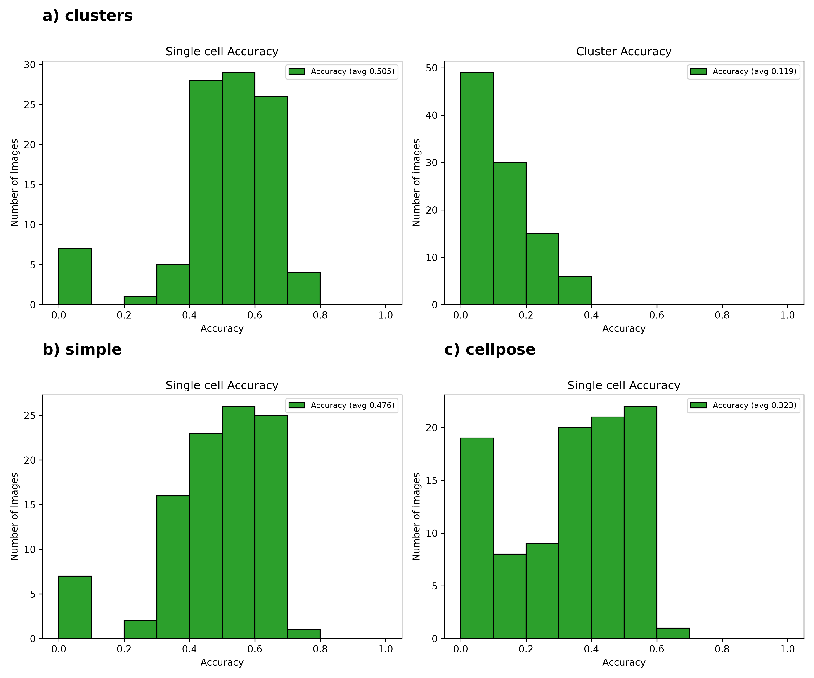

> **Fig. 9. Accuracy histogram.** a) *clusters*, b) *simple*, c) *cellpose*

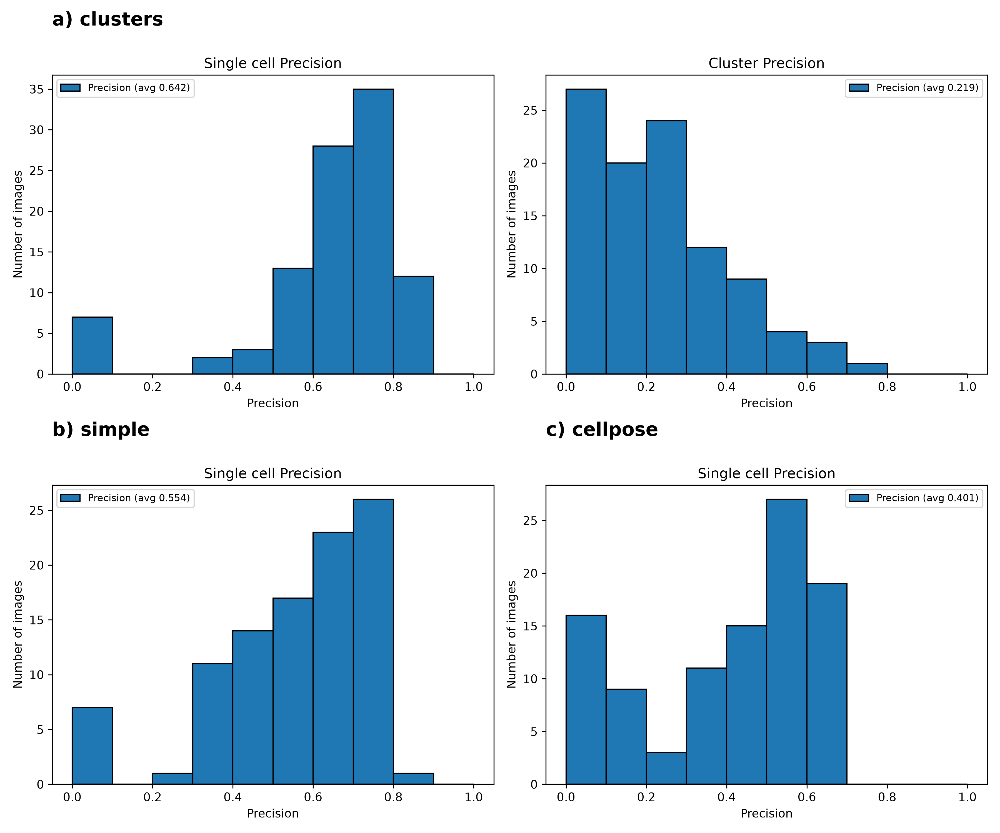

> **Fig. 10. Precision histogram.** a) *clusters*, b) *simple*, c) *cellpose*

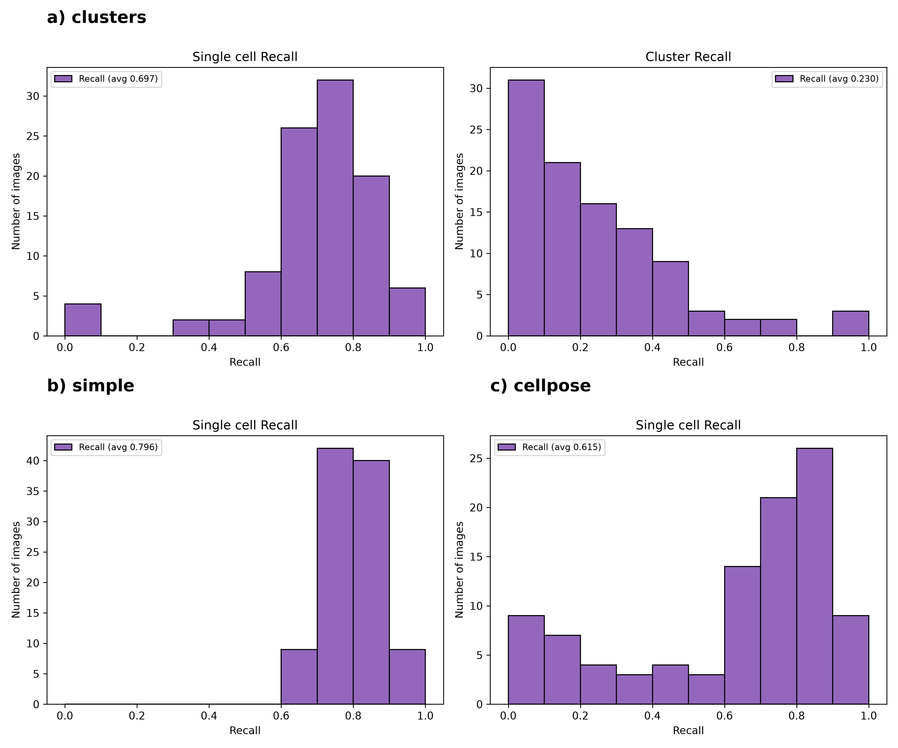

> **Fig. 11. Recall histogram.** a) *clusters*, b) *simple*, c) *cellpose*

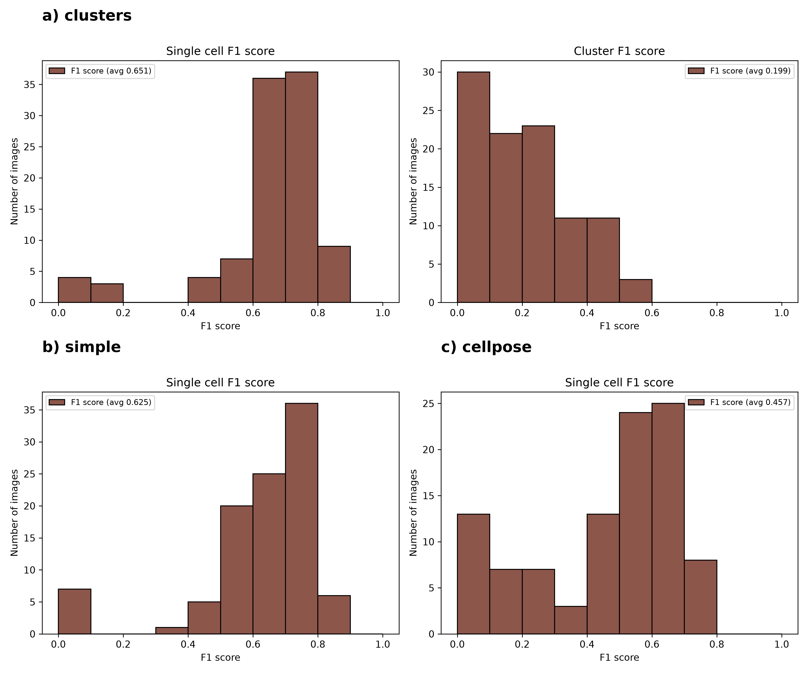

> **Fig. 12. F1 score histogram.** a) *clusters*, b) *simple*, c) *cellpose*

## Discussion

The dataset turned out to be quite difficult to analyze, the images were often not centered properly and contained a lot of structures which were not labeled as cells but were hard to distinguish, together with background noise such as shadows and counting chamber grid marks.

The separation into single cells and clusters which we originally tried did not work well, as there was no clear definition of cluster in the input labels. Still, the cells which were too small to be considered clusters were detected quite well.

Interestingly, the cellpose plugin did not work as expected, the results were worse than for the heuristic analysis pipelines. This could be due to the wrong use of the plugin, or the use of wrong pretrained model, and would be interesting to investigate. However, work performed using the cellpose plugin was also quite computationally demanding, compared to much simpler tools.

In the end, no single workflow performed well enough to be usable as tested. However, we have learned a lot about the caveats of creating workflows for such a simple problem as cell counting from scratch, which will definitely help us in the future if we consider cell counting is worth using in our project. In that case, we will probably extend our *simple* workflow to be more robust and try to use it for our specific use case.

In the repository [^3] associated with the original project the dataset was part of, the author claims to be able to identify almost all cells in the images with his AI-based workflow. We did not include this workflow in our comparison, but given the dataset quality, this seems to be an impressive result. If we decide to use this approach to estimate density of our cell culture, we will probably try to reuse his approach.

Additionally, during this work, I used a lot of AI-based agents to perform tedious tasks, such as debugging, rewriting workflow parts which would not work otherwise, upgrading shell scripts to support parallel computation, sketching and improving plots and performing basic data analysis computations. For the latter tasks, it was not surprising that such general and basic work was performed really well. What surprised me in a positive way was the ability to understand FIJI internals and to rewrite workflows, greatly improving the work speed.

## References and links

[^1]: https://github.com/Jajopi/project-microscopy
[^2]: https://www.kaggle.com/datasets/cenciarinigabriel/microalgae-microscope-20x-fov18
[^3]: https://github.com/Cenciarini/Microalgae-Vision-Counter
