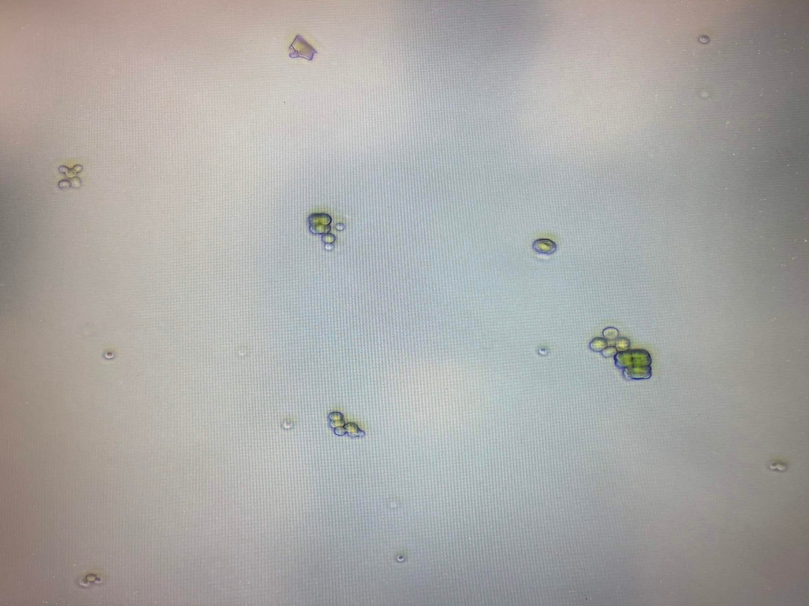

# Comparison of simple heuristic and Cellpose-based cell detection workflows in difficult cyanobacterial dataset

In this project, we propose several simple workflows for cell detection and counting, and compare their performance on a cyanobacterial dataset downloaded from Kaggle. The data, code and results are available in Github repository [^1].

## Motivation and objective

This year, I participate in the Prague iGEM team focusing on cyanobacteria cultivation. The project is still in the beginning, and one of the biggest challenges for us at the moment is to keep track of the basic properties of the cultures, such as the number of (living) cells. The main reason for this being so difficult is that the cells tend to clump together, making optical density measurements unreliable. One of the proposed workarounds is to use images from a sufficiently large number of samples and automate the cell counting.

> Fig. 1. Sample image of the culture taken in the lab. Note that the image is technically a photo of a computer screen, as we did not manage to automate the process yet.

However, we were not able to produce enough images to use as a dataset for workflow development. Therefore, we searched for cyanobacterial microscopy image datasets, and found a suitable one on Kaggle [^2]. The goal of the project was to propose, evaluate and compare several simple workflows to detect and count cells from raw images.

## Dataset

The dataset named Microalgae Population Microscopy for Automated Counting [^2] contains approximately 460 optical microscopy images of microalgae populations. We decided to use a subset consisting of first 100 images from `train` split, as comparing the workflows across all the images would require too much time.

The images were taken using mobile phone camera, through a light microscope with 20x maginification, and manually labeled by the author (although he also mentions some consultation with experts). There was only one class of labels, as all cells probably belonged to the same species.

The information about the dataset were written in spanish; however, we simply translated them using web browser extension.

## Methods and workflows

We tried two main approaches: using basic Analyze Particles function in FIJI, and using Cellpose plugin with pretrained machine learning model. With the first approach, we proposed two different workflows, based on whether large cell clusters were being detected as separate entities or not.

For each workflow and each image, we compared the detected cells to dataset labels, counting true positives, false positives (detections that were not in the label set) and false negatives (labels that were not detected). From those data, we computed accuracy, precision, recall and F1 score for each image.

Computing matching between the detected cells and labels was done using heuristic that matched closest pairs from which both cells were not yet matched, as long as the distance between them was less that half of the average size of the cells. We implemented this in Python script `compare_results.py`. The script also saves the initial image overlayed with the resulting rectangles around the detected cells and labels, colored by the type of the (mis)match: green for true positives, orange for false positives, and red for false negatives. This allowed us to visually inspect the results and see in which cases do the workflows fail and how. 

### Heuristic workflow with separate cluster detection

### Heuristic workflow without cluster separation

### Cellpose-based workflow

## Results

## Discussion

The dataset turned out to be quite difficult to analyze, the images were often not centered properly and contained a lot of structures which were not labeled as cells but were hard to distinguish, together with background noise such as shadows and counting chamber grid marks.

In the repository [^3] associated with the original project the dataset was part of, the author claims to be able to identify almost all cells in the images with his AI-based workflow. We did not include this workflow in our comparison, but given the dataset quality, this seems to be an impressive result. If we decide to use this approach to estimate density of our cell culture, we will probably try to reuse his approach. 

## References and links

[^1]: https://github.com/Jajopi/project-microscopy
[^2]: https://www.kaggle.com/datasets/cenciarinigabriel/microalgae-microscope-20x-fov18
[^3]: https://github.com/Cenciarini/Microalgae-Vision-Counter
